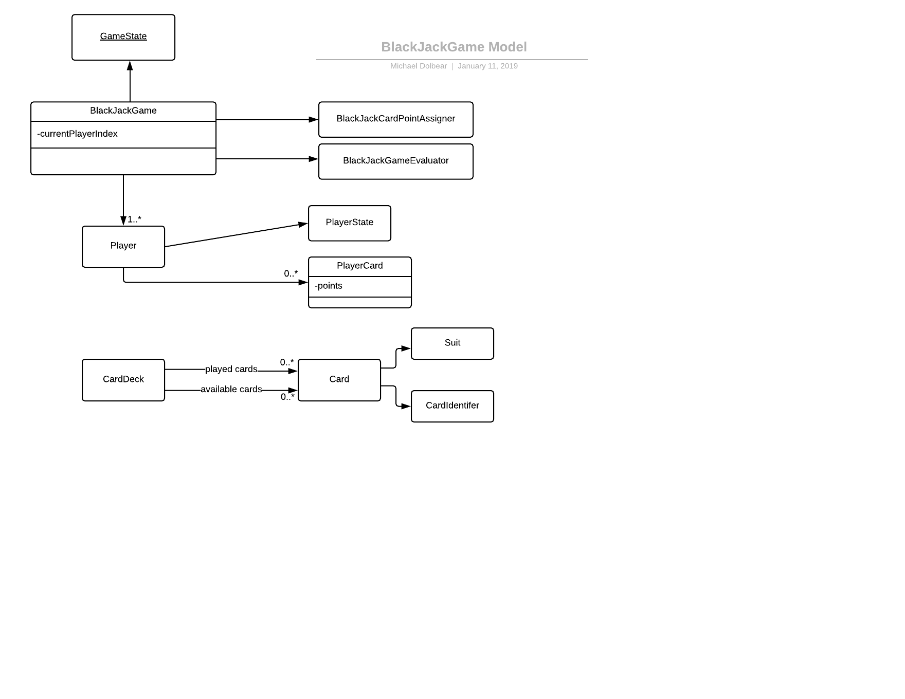

# blackjack
This is the first project I have tried with Spring-Boot running on top of a Mongo database. Its
a blackjack game (with some simplified rules because I have never played cards in my life). The persistence store
contains two separate collections, and I am using application.properties to point to the mongo db. I didn't use
the embedded mongo because I wanted get familiar with mongo and its tools.



To build:

mvn clean install -Pbuild-docker-image


To pull docker down to your local Docker:

```docker pull mongo```
```docker run -p 27017:27017 mongo```


#This configuration supports a kubernetes cluster. 

Do the following to load the kubernetes cluster:

cd src/main/resources/k8s
Now run ./constructCluster.sh


At this point on the mac, you will need to add an entry in your /etc/hosts file like so:

127.0.0.1       myblackjack.localhost

You wil have found this entry by doing the following:

kubectl get ingress

Utilize the entry fro HOSTS.

#Example:

kubectl get ingress

us17mac00258:~ micdol$ kubectl get ingress
NAME                HOSTS                   ADDRESS     PORTS     AGE
blackjack-ingress   myblackjack.localhost   localhost   80        16m


#Now play the game:

Play a game of black jack

Create card deck:
```curl -X POST http://myblackjack.localhost/blackjack/createCardDeck```
cardDeckId=5bc271f860d9ea00090b9ed1


Start a new game:
```curl -d "numberOfPlayers=2" http://myblackjack.localhost/blackjack/startgame```

gameId=5bc2721a60d9ea00090b9ed4

Get game state

```curl http://myblackjack.localhost/blackjack/gameState?gameId=5bc2721a60d9ea00090b9ed4```

Play a hand:

```curl -d "cardDeckId=5bc271f860d9ea00090b9ed1&gameId=5bc2721a60d9ea00090b9ed4" -X PUT http://myblackjack.localhost/blackjack/playHand```

Keep playing hands until the game terminates.

#Display k8s dashboard. 

This is an alternative to using kubectl: Instructions here: https://kubernetes.io/docs/tasks/access-application-cluster/web-ui-dashboard/

kubectl create -f https://raw.githubusercontent.com/kubernetes/dashboard/master/src/deploy/recommended/kubernetes-dashboard.yaml

kubectl proxy --port=8090

Now bring up a browser and go to http://<master-ip>:<apiserver-port>/api/v1/namespaces/kube-system/services/https:kubernetes-dashboard:/proxy/

Example: http://localhost:8090/api/v1/namespaces/kube-system/services/https:kubernetes-dashboard:/proxy/

#Remote debug a container in k8s cluster:

These changes are required in Dockerfile:

EXPOSE 4000
ENV JAVA_OPTS="-agentlib:jdwp=transport=dt_socket,server=y,address=4000,suspend=n"


These changes are required in my blackjack-service.yml:

  - name: debug
    port: 4000
    protocol: TCP
    targetPort: 4000
    
Now run

kubectl describe services blackjack

Under the response, pull out

NodePort:                 debug  31539/TCP
LoadBalancer Ingress:     localhost

and set up debugger url to be 

-agentlib:jdwp=transport=dt_socket,server=y,suspend=n,address=31539

in the Intellij or Eclipse debugger.


#To use Telepresence debugging with K8s: https://www.telepresence.io/

telepresence --swap-deployment blackjack --expose 8080 \
--run java -agentlib:jdwp=transport=dt_socket,server=y,address=4000,suspend=n -Dspring.profiles.active=prod -jar blackjack-1.0-SNAPSHOT.jar

Then you can set local breakpoints on localhost:4000


#To set up Prometheus monitoring:

Prometheus was created with the populating of the k8s cluster. Now
start and access the ui via a port forward:

kubectl get pods -n namespace

NAME                                     READY     STATUS    RESTARTS   AGE
prometheus-deployment-7c8fdf9b89-wsbx5   1/1       Running   0          6m

$ kubectl port-forward prometheus-deployment-7c8fdf9b89-wsbx5 9090:9090 -n monitoring

Now log into http://localhost:9090
If you go to Status->Service Discovery
and click on kubernetes-service-endpoints
you should see target labels for the blackjack pod

Now go to Status-> Targets you should see an endpoint in the state UP.

If you now go to the graph page, you should be able to pick some jvm* metrics and graph them.

#Swagger Documentation

I've added swagger documentation for this example:

```http://myblackjack.localhost/swagger-ui.html```
